# String And Number
## What is a Method in JavaScript?
A method is a block of code which only runs when
it is called. You can pass data, known as
parameters, into a method. Methods are used to
perform certain actions, and they are also known
as functions.
## Create s t r ing in JavaScr ipt
We can create string with three methods!
#### 1. Double Quotes 
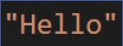
#### 2. Single Quotes 
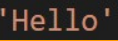
#### 3. Backticks 
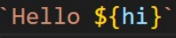
## JAVASCRIPT STRING METHODS!
### String have 14 methods!!
## JavaScript String method charAt() 
The charAt() method returns the character at a specified index (position) in a string.
The index of the first character is 0, the second 1, ...
The index of the last character is string length - 1 .
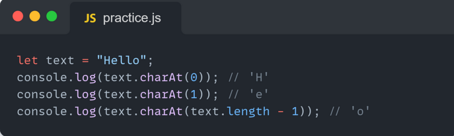
## JavaScript String method at()
The at() method takes an integer value and returns a new String.
This method allows for positive and negative integers. Negative
integers count back from the last string character.
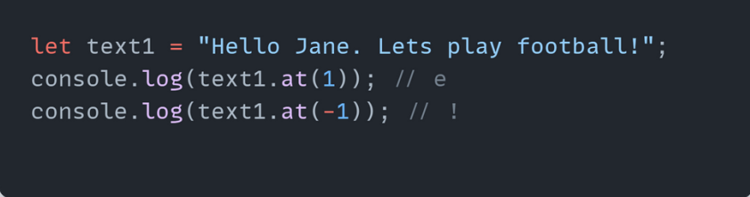
## JavaScript String method concat()
The concat() method joins two or more strings.
The concat() method returns a new string.
The concat() method does not change the original string.
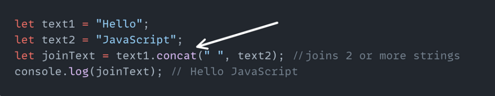
## JavaScript String method replace()
The replace() method returns a new string with the value(s) replaced.
The replace() method searches a string for a value or a regular expression.
The replace() method does not change the original string.
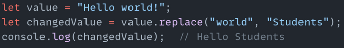
## JavaScript String method replaceAll()
The replaceAll() method returns a new string with all matches of a pattern replaced by
a replacement.
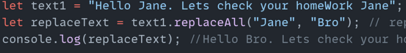
## JavaScript String method split()
The split() method splits a string into an array of substrings. The split() method
returns the new array. The split() method does not change the original string. If (" ") is
used as separator, the string is split between words.
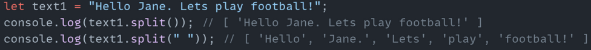
## JavaScript String method substring(start,end)
The substring() method extracts characters, between two indices (positions), from a string, and
returns the substring.
The substring() method extracts characters from start to end (exclusive).
The substring() method does not change the original string.
If start is greater than end, arguments are swapped: (4, 1) = (1, 4).
Start or end values less than 0, are treated as 0.
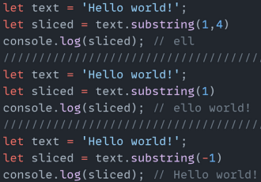
## JavaScript String method slice(start, end)
The slice() method returns a shallow copy of a portion of an array and string into a new array object
selected from start to end ( end not included) where start and end represent the index of items in
that array.
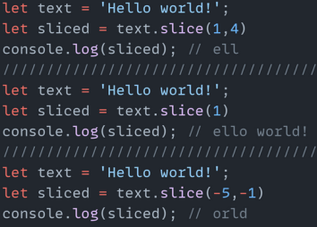
## JavaScript String method toLowerCase()
The toLowerCase() method converts a string to lowercase letters. The toLowerCase()
method does not change the original string.
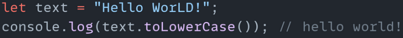
## JavaScript String method toUpperCase()
The toUpperCase() method converts a string to lowercase letters,using this locale
The toUpperCase() method does not change the original string.
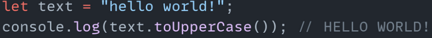
## JavaScript String method trim()
The trim() method removes whitespaces from both side of sentences.
The trim() method does not change the original string.
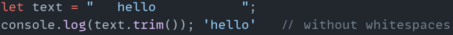
## JavaScript String method includes()
The includes() method returns true if a string contains a specified string.
Otherwise it returns false. The includes() method is case sensitive.
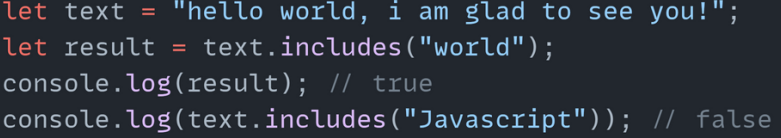
## JavaScript String method toString()
The toString() method returns a string representing
the object. By default toString() takes no parameters.
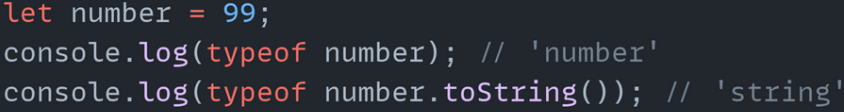
##  JavaScript String method indexOf()
The indexOf() method returns the position of the first occurrence of avalue in a string.
The indexOf() method returns -1 if the value is not found.
The indexOf() method is case sensitive.
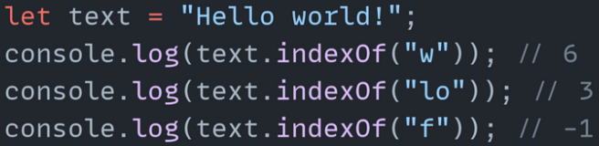
## JavaScript String method repeat()
The repeat() method creates a new string by repeating the given string a
specified number of times and returns it.
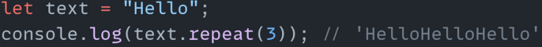
# JAVASCRIPT Methods Number
## JavaScript Number methods Math.round(),ceil(),floor()
The Math.floor() function rounds down a number to the next smallest integer.
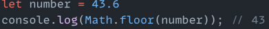
The Math.round() function returns the number rounded to the nearest integer.
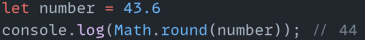
Math.ceil() method rounds a decimal number up to the next largest integer and returns it.
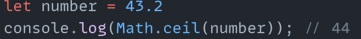
## JavaScript Number methods Math.max() and Math.min()
max() method finds the maximum value among the specified values and returns it
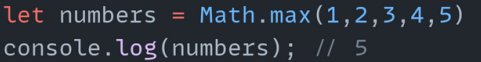
min() method finds the minimum value among the specified values and returns it.
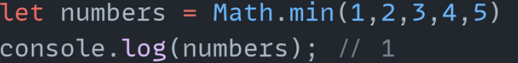
## JavaScript Number methods Math.pow() and Math.sqrt()
pow() method computes the power of a number by raising the second
argument to the power of the first argument.
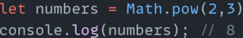
sqrt() method computes the square root of a specified number and returns it
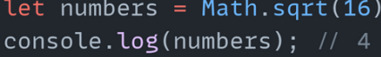
## JavaScript String method Math.abs() and Math.random()
abs() method finds the absolute value of the specified number (without any sign)
and returns it.
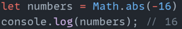
random() function returns a floating-point, pseudo-random number between0(inclusive)
and1(exclusive).
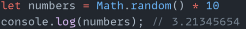
## JavaScript Number method isNaN()
isNaN() function checks if a value isNaN (Not-a-Number) or not
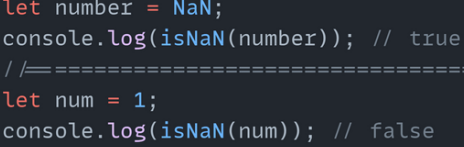
# Thanks For Attantion!
Have a good day!